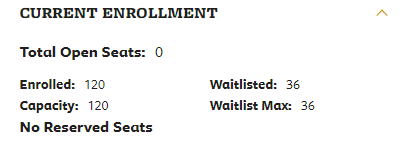
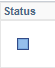

# The Berkeley Full Waitlist Enroller

**Got a terrible enrollment time this semester? Tired of seeing the image below?**
(that is totally me lol)

This probably won't help since enrollment is a lost cause, but at least you can save some time having to take a few minutes of your time trying to add the class manually just to see that blue square of doom.

## How to Use

**IMPORTANT: DO NOT TRUST UNKNOWN SOURCES WITH YOUR PASSWORDS!!** Only proceed if you have reviewed the source and have determined that this script indeed is not intelligent enough to steal your password and use it to buy 100,000 flex dollars.

1. Install [Python 3](https://www.python.org/downloads/) and [Chromedriver](https://chromedriver.chromium.org/downloads). You will need the latest version of Chrome (81 at the time this was written).
2. Clone the repository: `git clone https://github.com/64bitpandas/full-waitlist-enroller`
3. Enter the directory: `cd full-waitlist-enroller`
4. Install requirements: `pip install -r requirements.txt`
5. Place the `chromedriver.exe` file you downloaded into the directory.
5. Edit `constants.py` to add the class you want in `COURSE_NAME` and the swapped class in `SWAP_NAME`.
    - Example: `DATA C8` (must be all caps)
5. Run using `python enroll.py` and hope for the best.
6. Repeat once a week/day/hour (for extra laziness just set a cronjob or something)

**By default, this script uses the SWAP feature to replace a class you are already enrolled in with the full class (if successful, haha good luck).** I'd suggest to enroll in a class that's open and you are willing to swap out if you haven't already.

## How does it work?

This script uses the Calnet login script from [encadyma's caldining status checker](https://github.com/encadyma/dining_pts).

It uses [Selenium](https://www.selenium.dev/) to automate button-clicking and page reading for you!

To see exactly what's going on behind the scenes, set `HEADLESS` to `False` in `constants.py`. This will open up a Chrome window when running the script to show you which buttons are being pressed in the shopping cart by the script.

<!-- Insert more description -->

## FAQ

**There is a bug and/or it doesn't work with XX course?**
 - Create an [issue](https://github.com/64bitpandas/full-waitlist-enroller/issues) describing the problem and I'll probably ignore it.

**I ran this and it dropped me from all my classes. Who do I sue?**
 - Sue Denim

**Did this help you get into your classes?**
 - No. No it did not.

**Was it even worth it to make this then???**
 - Absolutely!

**I have a question not on this FAQ?**
 - ok